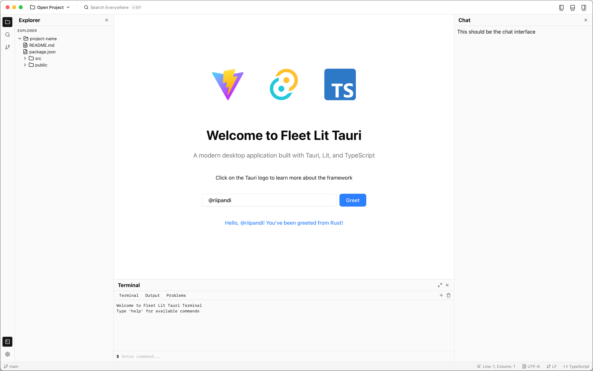

# 🦀 Fleet Lit Tauri

[](https://github.com/riipandi/fleet-lit-tauri/releases)
[](https://www.rust-lang.org)
[](https://tauri.app)
[](https://deps.rs/repo/github/riipandi/fleet-lit-tauri)

> [!WARNING]
> This project is experimental and may not be stable.

Experimental Fleet / Trae UI built with Tauri and Lit web components.

This project generated from [riipandi/tauri-start-lit](https://github.com/riipandi/tauri-start-lit).



## What's Inside?

- [x] Tauri v2 + Lit + TypeScript integration
- [x] Built-in router for multi-page applications
- [x] Optimized CSS with Lightning CSS
- [x] Themeable component system with OKLCH colors
- [x] Lucide Icons web component: `<lucide-icon>`
- [x] Persisted UI state management with Nano Stores
- [x] Customized Tauri window controls

## Recommended IDE Setup

[Visual Studio Code](https://code.visualstudio.com/) + [Recomended extensions](./.vscode/extensions.json)

### Fix Unsigned Warning (macOS)

> Warning: "Fleet Lit Tauri" is damaged and can't be opened.

This warning is shown because the build is not signed. Run the following command
 to suppress this warning:

```sh
xattr -r -d com.apple.quarantine "/Applications/Fleet Lit Tauri.app"
```

## License

Licensed under either of [Apache License 2.0][license-apache] or [MIT license][license-mit] at your option.

> Unless you explicitly state otherwise, any contribution intentionally submitted
> for inclusion in this project by you, as defined in the Apache-2.0 license, shall
> be dual licensed as above, without any additional terms or conditions.

Copyrights in this project are retained by their contributors.

See the [LICENSE-APACHE](./LICENSE-APACHE) and [LICENSE-MIT](./LICENSE-MIT) files
for more information.

[rust]: https://www.rust-lang.org/tools/install
[lit]: https://lit.dev
[biome]: https://biomejs.dev
[nodejs]: https://nodejs.org/en/download
[pnpm]: https://pnpm.io/installation
[license-mit]: https://choosealicense.com/licenses/mit/
[license-apache]: https://choosealicense.com/licenses/apache-2.0/

---

<sub>🤫 Psst! If you like my work you can support me via [GitHub sponsors](https://github.com/sponsors/riipandi).</sub>
